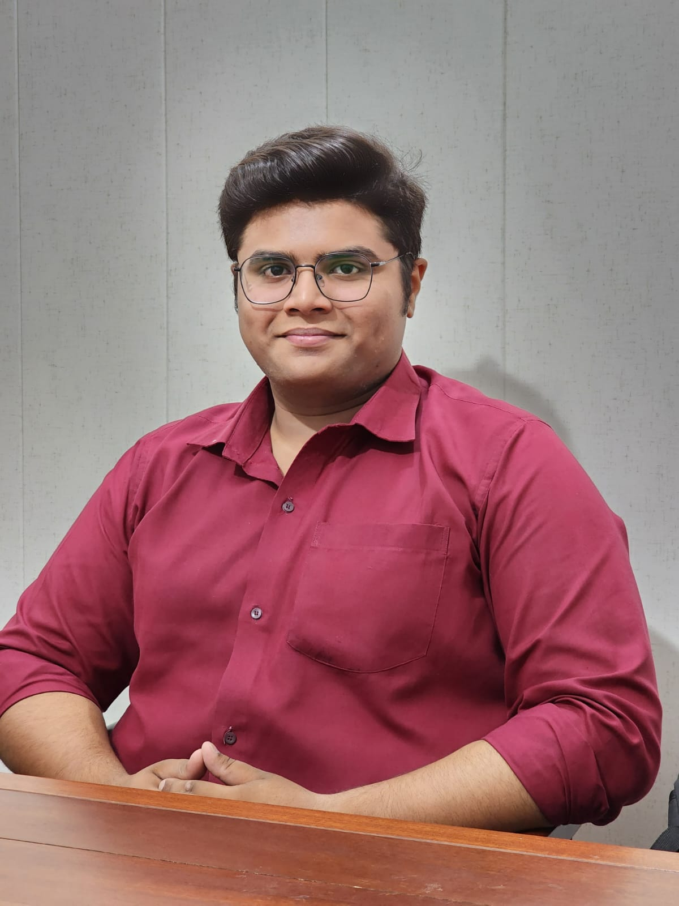

# rafay.github.io
<!DOCTYPE html>
<html lang="en">
<head>
    <meta charset="UTF-8">
    <meta name="viewport" content="width=device-width, initial-scale=1.0">
    <title>Portfolio</title>
    
</head>

<body>
    <h1>Portfolio</h1>
    
    
    <b>
Name:</b>Rafay Ahmad Hussain

        <b>
Father Name:</b>Zahid Hussain

         <h2><u>Academic Record</u></h2>
         <h3>Matriculation</h3>
            <ul>
                <li>
<b>Institution Name:</b>"Unique Group Of Institutions"
</li>
                <li>
<b>Marks:</b>1062/1100
</li>
                <li><b>Degree Duration:</b>:2018-2020</li>
                <li>
<b>Link:</b><a href="c:\Users\Dell\Downloads\Board of Intermediate & Secondary Education,Lahore.html"target="blank">Matriculation Result Card</a>
</li>
            </ul>
            <h3><b>Intermediate</b></h3>
            <ul>
                <li>
<b>Institution Name:</b>Punjab Group of Colleges
</li>
                <li>
<b>Marks:</b>1051/1100
</li>
                <li>
<b> Degree Duration:</b>2020-2022
</li>
                <li>
<b>Link:</b><a href="c:\Users\Dell\Downloads\Inter_Result_Card.html"target="blank">Intermediate Reult Card</a>
</li>
            </ul>
            <h3><b>Professional Studies</b></h3>
            <ul>
                <li><b>B</b>achelors in <b>C</b>omputer . <b>S</b>ciences</li>
                <li>
<b>Institution Name:</b>Punjab University College of Information Technology <b>(P.U.C.I.T / F.C.I.T)</b>
</li>
                <li><b>C.G.P.A :</b>3.74</li>
                <li>
<b>Degree Duration:</b>2022-2025
</li>
            </ul>
            <h3><b>Curricular Achievements</b></h3>
            <ul>
                <li>
Scholarship based matriculation from U.G.I
</li>
                <li>
Scholarship based intermediate from P.G.C
</li>
            </ul>
            <h3><b>Co-Curricular Achievements</b></h3>
            <ul>
            <li>
 Student Editor of U.G.I High School Official Magzine <b>"Aks-e-Unique"</b>
</li>
            <li>
Winner of <b>"All Lahore Debate Competition 2019"</b>
</li>
            </ul>
            <h3><b><u>Professional Skills</u></b></h3>
            <ul>
                <li>C++</li>
                <li>C</li>
                <li>Python</li>
                <li>DJango</li>
                <li>HTML</li>
                <li>CSS</li>
                <li>Java Script</li>
                <li>React JS</li>
                <li>Node JS</li>
                <li>Express JS</li>
                <li>Mongo DB</li>
            </ul>
            <h3><b><u>Additional Skills</u></b></h3>
            <ul>
                <li> Proficiency in Microsoft Offices</li>
                <li>Proficiency in advance MS Excel</li>
                <li>Diploma in Communication and Marketing</li>
            </ul>
            <h3><b><u>Hobbies</u></b></h3>
            <ul>
                <li>Book Reading</li>
                <li>Literary Meetings and Sittings</li>
                <li>Poetry</li>
                <li>Poetic Symposiums</li>
                <li>Company of Poets and Novel Writters</li>
            </ul>
            <h3><b><u>Professional Contact Informations</u></b></h3>
            <ul>
                <li><b>Email:</b><a href="mailto:rafayzahid755gmail.com"target="blank">rafayzahid755@gmail.com</a></li>
                <li><b>Linkdin:</b><a href="https://www.linkedin.com/in/rafay-ahmad-hussain-a7b917270/?lipi=urn%3Ali%3Apage%3Ad_flagship3_feed%3BzD1uTBETSk6gCdvA3R8W1Q%3D%3D"target="blank">Rafay Ahmad Hussain</a></li>
            </ul>

            

        
         

        

    
</body>
</html>
